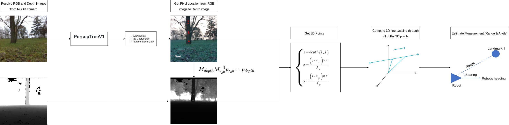

# Tree SLAM Package

The Tree SLAM Package uses a custom frontend node to detect trees in the environment using the [PerceptTreeV1](https://github.com/norlab-ulaval/PercepTreeV1) pre-trained model  and send their locations with respect the camera's frame to a backend node running a custom EKF SLAM algorithm.

-----

# Dependencies

* ROS Noetic
* PyTorch
* Detectron2
* OpenCV Python
* NumPy

# 1 Nodes

## 1.1 detect_node.py
Node in charge of running Percept3V1 in an incoming RGb frame, get three tree trunk instances, compute 3D points with respect the camera's frame and discard or accept measruemnts according to how they succed on representing a straing 3D vertical line.

### 1.1.1 Subscribed Topics

- camera/color/image_raw/compressed (sensor_msgs/CompressedImage): RGB image receive by RGBD camera. It is required to modify the intrinic parameters depending on the camera in the detection_params.yaml.

- camera/depth/image_raw (sensor_msgs/Image): Depth image coming from depth camera in simulated environment. It is required to modify the intrinic parameters depending on the camera in the sim_detection_params.yaml.

- camera/depth/image_rect_raw (sensor_msgs/Image): Depth image coming from depth camera in real environment. It is required to modify the intrinic parameters depending on the camera in the real_detection_params.yaml.

### 1.1.2 Published Topics

- /tree_scan (std_msgs/Float32MultiArray): Array having [range, angle] structure. 

## 1.2 slam_node.py
EKF SLAM node using the constant velocity model for a differentiial wheel drive robot and the range-bearing angle model for the measurement model of the static landmarks.

### 1.2.1 Subscribed Topics
- odom (nav_msgs/Odometry): Robot Odometry source to predict the robot's ego motion.
- tree_scan (std_msgs/Float32MultiArray): Measurement coming from the detect_node.py having both range and angle measruemnts from the camera's frame to a given tree. 

### 1.2.2 Published Topics
- robot_cov (visualization_msgs/Marker): Ellipse marker representing the robot's positions (x, y) and uncertainty.
- landmarks (visualization_msgs/MarkerArray): Array of ellipse markers representing the positions and uncertainties of each detected trees.

# 2 Results

## 2.1 Results on Simulated Data

## 2.2 Results on Real Data

# 3 How to Use the Package

Go to your `src` folder inside your catking workspace.  
`cd catkim_ws/src`

Copy this repository into the workspace.  
`git clone git@github.com:enriquea52/Tree-SLAM.git` 

Launch the nodes (for simulated data).  
`roslaunch tree_slam sim.launch` 

Launch the nodes (for real data).  
`roslaunch tree_slam real.launch` 